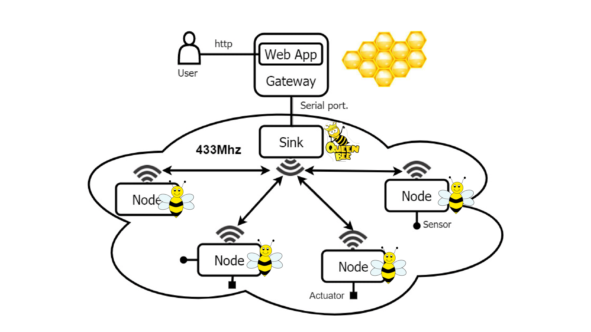
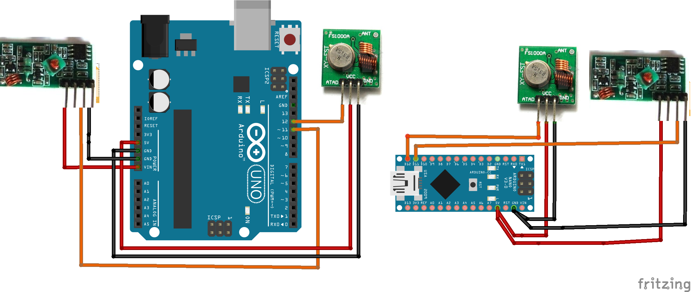
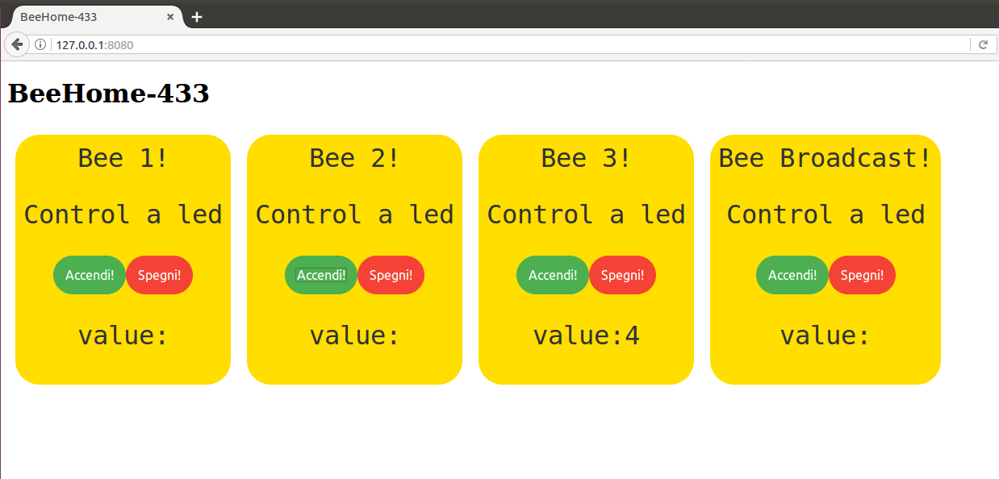

# beehouse-433

``` 
Smart house based on 433Mhz band
```

Davide Neri: davide.neri@di.unipi.it

**Video use case**: https://www.youtube.com/watch?v=yvfxI-R9Ju4 

**Slides**: <a href="./docs/beeHouse-433_Neri.pdf">Slides of the project</a>


## Architecture
The architecture has a *star* topology composed by:
- **node(s)** (bees):every node has sensors and actuators and communicate with the sink.
- **sink** (BeeQueen): is the central node in the topology that receives all the messages from nodes.
- **gateway** (BeeHive): receives the msg from serial port from the sink and serves a web server.

<p align="center">

</p>


### 433Mhz Wireless communication
**Nodes** and **sink** communicate using 433Mhz RF.

Each node has a recevier and a trasmitter.

<p align="center">

</p>

### WebApp dashboard

**Gateway** is the server that expose a WebPage used by the users for controlling the nodes.

```
$ cd beehive-server
$ node app.js
```

<p align="center">

</p>
